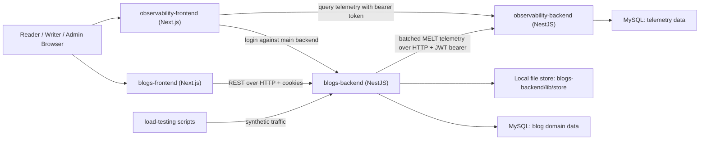

# Zeon Master Technical Reference

Zeon is a TypeScript multi-workspace project composed of a NestJS blog backend, a Next.js blog frontend, a separate observability product with its own NestJS and Next.js applications, a small load-testing harness, and supporting documentation. The repository already contains a meaningful product arc: account creation, editorial writing, blog publishing, comments, uploads, telemetry forwarding, observability ingestion, dashboard analytics, issue grouping, and benchmark scripts. It also shows the seams of an actively evolving system: some workflows are intentionally additive and forward-looking, several UI surfaces are partially implemented, and a few backend/frontend contracts currently diverge. This document is designed to be the single deep reference for architecture, behavior, relationships, constraints, and known debt.

## 1. Project Overview

### 1.1 Project name, purpose, and problem solved

- **Project name:** Zeon Blog / Zeon Observability
- **Primary purpose:** provide a content publishing platform with author workflows, reader-facing content discovery, comments, uploads, and first-party observability over application traffic and behavior.
- **Problem solved:** the repository combines:
  1. a public/content application for publishing and reading blogs,
  2. a lightweight editorial workspace for authors and admins,
  3. an observability platform that ingests MELT-style telemetry (metrics, events, logs, traces),
  4. repeatable local load tests for performance verification.

### 1.2 Core value proposition

- Writers can create, update, publish, unpublish, schedule, and restore blog revisions.
- Readers can browse published public posts, open individual articles, and participate in comments.
- Operators can inspect traffic, errors, latency buckets, recent incidents, traces, logs, and correlation views.
- Developers can test product behavior and performance in one repo, using shared TypeScript conventions and documentation.

### 1.3 Technology stack

| Area | Stack |
|---|---|
| Main backend | TypeScript, NestJS 11, TypeORM 0.3, MySQL, Passport JWT, class-validator, Swagger |
| Main frontend | TypeScript, Next.js 16 App Router, React 19, Redux, Tailwind CSS 4, Tiptap, react-markdown, react-toastify |
| Observability backend | TypeScript, NestJS 11, TypeORM 0.3, MySQL, JWT verification, class-validator |
| Observability frontend | TypeScript, Next.js 16 App Router, React 19, react-toastify |
| Load testing | Node.js ESM scripts, native `fetch`, `FormData`, `Blob`, custom timing/stat helpers |
| Testing | Jest, Vitest, Testing Library, jsdom, supertest |
| Documentation | Markdown in `docs/` plus repo-level guidance files |

### 1.4 High-level architecture style

- **Overall style:** hybrid multi-application monorepo
- **Main app style:** modular monolith
  - single NestJS backend
  - single Next.js frontend
  - single MySQL schema for product data
- **Observability style:** companion service pair
  - separate ingestion/query API
  - separate dashboard UI
  - separate MySQL schema for telemetry data
- **Performance tooling style:** standalone local scripts, not part of runtime serving path

### 1.5 Target users and use cases

| User | Use cases |
|---|---|
| Anonymous reader | Browse public blogs, read articles, inspect author profile pages |
| Authenticated reader/writer | Sign up, log in, comment, edit own profile |
| Writer | Create drafts, publish posts, schedule posts, manage revisions, preview drafts |
| Admin | Manage users, access diagnostics, access observability dashboard |
| Developer | Run apps locally, inspect contracts, extend modules, run tests and load scenarios |
| Operator | Review metrics, logs, events, traces, grouped issues, and correlation data |

## 2. System Architecture

### 2.1 Overall architecture diagram



### 2.2 Separation of concerns

#### Main blog backend

- `src/main.ts`: bootstrap, CORS, versioning, global middleware/pipes/filters/interceptors, Swagger.
- `src/app.module.ts`: composition root and database configuration.
- `src/common/`: cross-cutting infrastructure:
  - exception filter,
  - request ID middleware,
  - metrics recorder,
  - request timing interceptor,
  - observability forwarder.
- `src/modules/Auth`: signup/login/self/logout and JWT verification.
- `src/modules/Users`: current-profile APIs, public-profile API, admin user list/delete.
- `src/modules/Blogs`: public blog reading plus author editorial management.
- `src/modules/Comments`: comment listing, creation, update, soft delete.
- `src/modules/Upload`: authenticated image upload to local disk.
- `src/health`: health check.
- `src/diagnostics`: runtime/admin metrics snapshot.

#### Main blog frontend

- `src/app/`: route-level UI using Next.js App Router.
- `src/app/components/`: reusable page and feature components.
- `src/app/Redux/`: client auth/theme state.
- `src/lib/api/`: REST client wrappers for backend contracts.
- `src/lib/`: session helpers, auth client wrappers, URL utilities, legacy mock-content helpers.

#### Observability backend

- `src/common/auth`: bearer-token auth, role gating, operator/service caller separation.
- `src/modules/telemetry`: DTO and entity definitions plus compatibility schema helper.
- `src/modules/ingestion`: protected MELT batch ingestion.
- `src/modules/query`: analytics, bucketing, recent request views, issue grouping, retention diagnostics.
- `src/modules/correlation`: request/trace lookup across all telemetry types.
- `src/modules/diagnostics`: backend health/runtime/ingestion stats.

#### Observability frontend

- route-group dashboard pages for overview, metrics, logs, events, traces, issues, correlation.
- shared dashboard shell for nav, global filters, refresh policy, theme.
- local JWT storage utilities and admin-route guard hook.

### 2.3 Layer communication

| From | To | Mechanism |
|---|---|---|
| Blog browser | `blogs-frontend` | Next.js page rendering and client interactivity |
| `blogs-frontend` | `blogs-backend` | REST over HTTP, cookie-based auth, JSON, multipart for uploads |
| `blogs-backend` | Blog MySQL | TypeORM repositories and query builders |
| `blogs-backend` | local upload store | synchronous filesystem writes |
| `blogs-backend` | `observability-backend` | batched HTTP POSTs to `/ingest/*`, signed service JWT |
| `observability-frontend` | `blogs-backend` | admin login via `/auth/login` |
| `observability-frontend` | `observability-backend` | bearer-authenticated REST queries |
| `load-testing` | `blogs-backend` | scripted HTTP requests |

### 2.4 Synchronous vs asynchronous flows

#### Synchronous

- frontend to backend requests
- backend controller to service to repository to database
- upload write path
- observability query endpoints
- observability dashboard fetches

#### Asynchronous

- blog backend telemetry forwarding:
  - request interceptor and exception filter emit telemetry into an in-memory queue
  - `ObservabilityForwarderService` flushes batches on a timer
- observability ingestion persistence:
  - ingestion controller enqueues items
  - `IngestionService` flushes queued items to database on an interval

### 2.5 Event-driven / queue-based / pub-sub mechanisms

- There is **no external broker** such as RabbitMQ, Kafka, SQS, or Redis streams.
- Both telemetry pipelines are **in-memory batch queues**:
  - main backend queue: `ObservabilityForwarderService`
  - observability backend queue: `IngestionService`
- This makes local setup simple, but durability is process-bound.

### 2.6 Caching strategy

- Main backend: no explicit response cache.
- Blog frontend:
  - many fetches use `cache: 'no-store'`.
  - SEO routes are marked `dynamic = "force-dynamic"`.
- Observability frontend:
  - `useObservabilityData` keeps an in-memory per-path cache to preserve prior data while refreshing.
- No Redis, CDN config, ISR cache policy, or server-side cache invalidation layer is defined in repo code.

### 2.7 Authentication and authorization architecture

#### Main blog application

- Authentication method: JWT signed by main backend, stored in `access_token` cookie.
- Transport: cookie-based for application flows.
- Server validation: Passport JWT strategy extracts token from cookie.
- Authorization: mostly role/ownership checks in services.

#### Observability application

- Dashboard login reuses main backend `/auth/login`.
- Observability frontend stores the returned access token in localStorage.
- Observability backend accepts:
  - **service JWTs** for ingestion (`role: service`)
  - **main JWTs** for operator/admin queries (`role: admin`)
- Authorization: `RolesGuard` enforces `service` or `admin`.

> Architectural decision: Zeon treats observability as a companion product, not as a library embedded inside the blog backend. Telemetry crosses an HTTP boundary, which keeps responsibilities clear and allows the dashboard to authenticate separately.

## 3. Complete Project Directory Structure

### 3.1 Scope note

- This section inventories the **authored/source-of-truth repository files** plus committed sample artifacts and untracked repo-level notes visible in the workspace.
- **Dependency and generated directories** such as `node_modules/`, `.next/`, and `dist/` exist locally but are not source of truth; they are summarized rather than itemized file-by-file.

### 3.2 Top-level structure

| Path | Purpose |
|---|---|
| `AGENTS.md` | Repo operating instructions for tooling agents and contributors. |
| `ENGINEERING.md` | Engineering handbook describing workspace topology and ownership. |
| `codex_pr_rules.md` | PR safety and validation rules. |
| `DEEP_Research_Report_Phase_4.md` | Untracked research note for earlier product phase. |
| `DEEP_Research_Report_Phase_5.md` | Untracked research note for Phase 5. |
| `DEEP_Research_Report_Phase_5A.md` | Untracked research note for Phase 5A. |
| `blogs-backend/` | Main NestJS product backend. |
| `blogs-frontend/` | Main Next.js product frontend. |
| `docs/` | Safe project docs, reports, and checklists. |
| `load-testing/` | Local benchmark scenarios and results. |
| `zeon-observability/` | Standalone observability workspace. |

### 3.3 `blogs-backend/`

- `blogs-backend/` — package root for the main backend.
- `.gitignore` — ignore rules for build/test/runtime artifacts.
- `.prettierrc` — Prettier formatting settings.
- `README.md` — package-level purpose and navigation guide.
- `eslint.config.mjs` — ESLint config for Node/Nest TypeScript files.
- `lib/` — local runtime artifact folder for stored uploads.
- `lib/store/` — static media storage directory exposed by `ServeStaticModule`.
- `lib/store/32da5a6b-5aa2-4533-9e26-5c9e9eae241b.png` — committed sample uploaded image artifact.
- `lib/store/34e942ca-7f00-4b05-bd46-4ddb865f3399.png` — committed sample uploaded image artifact.
- `lib/store/3865b62f-5b28-43fa-a0c4-aa6bbbe8490b.png` — committed sample uploaded image artifact.
- `lib/store/54c7afbf-efb0-4d31-bb35-d6cdbb037c75.png` — committed sample uploaded image artifact.
- `lib/store/85bf8383-cb1b-4d17-8f7f-aeae3a11e085.jpg` — committed sample uploaded image artifact.
- `lib/store/90978396-4c38-4632-8cdd-7e3ad1076fa0.png` — committed sample uploaded image artifact.
- `lib/store/95f4ef12-a615-4ea2-893c-14d0eb36a28b.png` — committed sample uploaded image artifact.
- `lib/store/b1fd2a0a-1c23-44f4-a79b-5aefaab277dd.png` — committed sample uploaded image artifact.
- `lib/store/fedbda50-3f17-441f-8e3a-01e95c2b9b34.png` — committed sample uploaded image artifact.
- `nest-cli.json` — Nest CLI project configuration.
- `package-lock.json` — npm dependency lockfile.
- `package.json` — package scripts, runtime deps, dev deps, and Jest config.
- `src/` — authored backend source tree.
- `src/main.ts` — application bootstrap and HTTP pipeline configuration entry point.
- `src/app.module.ts` — main module composition and TypeORM/static-file setup.
- `src/app.controller.ts` — trivial root controller for hello-world response.
- `src/app.controller.spec.ts` — Jest unit test for root controller.
- `src/app.service.ts` — trivial root service used by the root controller.
- `src/common/` — shared backend infrastructure.
- `src/common/http-exception.filter.ts` — global exception-to-JSON transformer plus log/event emission.
- `src/common/http-exception.filter.test.ts` — Vitest coverage for exception filter behavior.
- `src/common/middleware/` — request pipeline middleware.
- `src/common/middleware/request-id.middleware.ts` — assigns or sanitizes `x-request-id`.
- `src/common/telemetry/` — request metrics and observability bridge.
- `src/common/telemetry/melt.types.ts` — shared telemetry record type definitions.
- `src/common/telemetry/metrics.service.ts` — in-memory recent/aggregate request metrics collector.
- `src/common/telemetry/observability-forwarder.service.ts` — async batch forwarder from blog backend to observability backend.
- `src/common/telemetry/observability-forwarder.service.test.ts` — Vitest coverage for forwarder behavior.
- `src/common/telemetry/request-timing.interceptor.ts` — interceptor that records metrics and trace events around responses/errors.
- `src/common/telemetry/request-timing.interceptor.test.ts` — Vitest coverage for timing interceptor behavior.
- `src/common/telemetry/telemetry.module.ts` — global Nest module exporting telemetry services.
- `src/diagnostics/` — admin diagnostics surface.
- `src/diagnostics/diagnostics.controller.ts` — runtime and metrics snapshot endpoints.
- `src/diagnostics/diagnostics.controller.test.ts` — Vitest coverage for diagnostics controller.
- `src/diagnostics/diagnostics.module.ts` — diagnostics module registration.
- `src/guards/` — miscellaneous guards not currently wired into active routes.
- `src/guards/client-header.guard.ts` — optional header-validation guard for `x-client-id` and `x-request-source`.
- `src/health/` — health-check module.
- `src/health/health.controller.ts` — simple `status: ok` endpoint.
- `src/health/health.controller.spec.ts` — Jest unit test for health controller.
- `src/health/health.module.ts` — health module registration.
- `src/migrations/` — manual migration folder.
- `src/migrations/AddCommentModerationStatus.ts` — additive migration for comment moderation status index/column.
- `src/modules/` — feature modules.
- `src/modules/Auth/` — authentication feature.
- `src/modules/Auth/auth.module.ts` — auth module composition with JWT signing config.
- `src/modules/Auth/config/jwt-secret.ts` — helper that requires `JWT_SECRET`.
- `src/modules/Auth/config/jwt-secret.spec.ts` — tests for JWT secret resolution.
- `src/modules/Auth/controller/auth.controller.ts` — signup, login, self, logout endpoints.
- `src/modules/Auth/controller/auth.controller.spec.ts` — controller tests for auth routes.
- `src/modules/Auth/dto/auth-response.dto.ts` — Swagger DTO for auth responses.
- `src/modules/Auth/dto/login.dto.ts` — validated login request DTO.
- `src/modules/Auth/dto/signup.dto.ts` — validated signup request DTO with strong-password rules.
- `src/modules/Auth/guard/jwt-auth.guard.ts` — route guard enforcing cookie presence plus Passport auth.
- `src/modules/Auth/guard/jwt-auth.guard.test.ts` — tests for auth guard behavior.
- `src/modules/Auth/guard/jwt.strategy.ts` — Passport strategy that decodes JWT from cookie.
- `src/modules/Auth/services/auth.service.ts` — signup/login/self business logic and auth telemetry emission.
- `src/modules/Auth/services/auth.service.spec.ts` — Jest/Vitest-style auth service coverage.
- `src/modules/Auth/services/auth.service.test.ts` — duplicate-named auth service tests under Vitest pattern.
- `src/modules/Auth/types/current-user.type.ts` — minimal authenticated-user type used across controllers/services.
- `src/modules/Blogs/` — blog content and editorial workflow feature.
- `src/modules/Blogs/blogs.module.ts` — blog module composition with blog/tag/user/comment/revision repositories.
- `src/modules/Blogs/controller/blogs.controller.ts` — public and author blog endpoints.
- `src/modules/Blogs/controller/blogs.controller.spec.ts` — controller tests for blog routes.
- `src/modules/Blogs/controller/blogs.controller.test.ts` — additional controller tests under Vitest naming.
- `src/modules/Blogs/dto/create-blog.dto.ts` — validated create-blog contract.
- `src/modules/Blogs/dto/update-blog.dto.ts` — partial update contract based on create DTO.
- `src/modules/Blogs/dto/query-blog.dto.ts` — pagination and filter DTO for list endpoints.
- `src/modules/Blogs/dto/schedule-blog.dto.ts` — future publish timestamp DTO.
- `src/modules/Blogs/entities/blogs.entities.ts` — core `Blog` entity plus status/visibility enums.
- `src/modules/Blogs/entities/tag.entities.ts` — tag entity for many-to-many taxonomy.
- `src/modules/Blogs/entities/blog-revision.entity.ts` — revision snapshot entity for editorial history.
- `src/modules/Blogs/services/blogs.service.ts` — primary blog business logic, SEO metadata, revisioning, scheduling, and telemetry.
- `src/modules/Blogs/services/blogs.service.spec.ts` — blog service tests.
- `src/modules/Blogs/services/blogs.service.test.ts` — additional blog service tests under Vitest naming.
- `src/modules/Blogs/services/trial.ts` — fully commented-out legacy blog service draft preserved as dead code.
- `src/modules/Comments/` — comments feature.
- `src/modules/Comments/comments.module.ts` — comment module composition.
- `src/modules/Comments/controller/comments.controller.ts` — list/create/update/delete comment endpoints.
- `src/modules/Comments/dto/comment-response.dto.ts` — Swagger response DTOs for comments.
- `src/modules/Comments/dto/create-comment.dto.ts` — validated comment-creation DTO.
- `src/modules/Comments/dto/query-comments.dto.ts` — comment pagination/sorting/filter DTO.
- `src/modules/Comments/dto/update-comment.dto.ts` — validated comment-update DTO.
- `src/modules/Comments/entities/comment.entity.ts` — soft-deletable threaded comment entity.
- `src/modules/Comments/services/comments.service.ts` — comment business logic, rate limiting, sanitization, and telemetry.
- `src/modules/Comments/services/comments.service.spec.ts` — comment service tests.
- `src/modules/Upload/` — upload feature.
- `src/modules/Upload/upload.module.ts` — upload module registration.
- `src/modules/Upload/controller/upload.controller.ts` — authenticated multipart upload endpoint.
- `src/modules/Upload/services/upload.service.ts` — MIME validation and local file persistence service.
- `src/modules/Upload/services/upload.service.spec.ts` — Jest/Vitest upload service tests.
- `src/modules/Upload/services/upload.service.test.ts` — additional upload service tests.
- `src/modules/Users/` — user profile/admin feature.
- `src/modules/Users/users.module.ts` — users module registration.
- `src/modules/Users/controller/users.controller.ts` — current user, public user, admin list, and delete endpoints.
- `src/modules/Users/controller/users.controller.spec.ts` — users controller tests.
- `src/modules/Users/dtos/public-user-response.dto.ts` — Swagger DTO for public-safe user response.
- `src/modules/Users/dtos/query-users.dto.ts` — user-list pagination/filter DTO.
- `src/modules/Users/dtos/update-user-profile.dto.ts` — validated user-profile update DTO.
- `src/modules/Users/dtos/user-response.dto.ts` — Swagger DTO for full user profile response.
- `src/modules/Users/entities/user.entities.ts` — user entity and role enum.
- `src/modules/Users/services/users.service.ts` — current-profile logic, public lookup, admin list/delete, and role checks.
- `src/modules/Users/services/users.service.spec.ts` — users service tests.
- `src/modules/Users/services/trial.ts` — empty legacy placeholder file.
- `test/` — e2e-oriented test configuration.
- `test/app.e2e-spec.ts` — Jest e2e test scaffold for application bootstrapping.
- `test/jest-e2e.json` — Jest e2e configuration.
- `tsconfig.build.json` — build-target TypeScript config extension.
- `tsconfig.json` — primary TypeScript compiler configuration.
- `vitest.config.ts` — Vitest configuration for `.test.ts` files.
- `vitest.setup.ts` — Vitest bootstrapping hooks.

### 3.4 `blogs-frontend/`

- `blogs-frontend/` — package root for the main frontend.
- `.gitignore` — frontend artifact ignore rules.
- `README.md` — frontend purpose and navigation guide.
- `eslint.config.mjs` — frontend ESLint configuration.
- `next.config.ts` — Next.js config with explicit Turbopack root.
- `package-lock.json` — npm dependency lockfile.
- `package.json` — scripts and runtime/dev dependencies.
- `postcss.config.mjs` — PostCSS/Tailwind integration.
- `public/` — static assets served by Next.js.
- `public/file.svg` — default Next.js static SVG asset.
- `public/globe.svg` — default Next.js static SVG asset.
- `public/hero-cover.svg` — hero illustration used on the home page.
- `public/next.svg` — default Next.js logo asset.
- `public/vercel.svg` — default Vercel logo asset.
- `public/window.svg` — default Next.js static SVG asset.
- `src/app/` — App Router routes and app-wide UI.
- `src/app/favicon.ico` — app favicon.
- `src/app/globals.css` — global CSS and Tailwind styles.
- `src/app/layout.tsx` — root layout with providers, navbar, footer, and toast container.
- `src/app/page.tsx` — home page composition.
- `src/app/robots.ts` — robots.txt metadata route.
- `src/app/sitemap.ts` — sitemap metadata route.
- `src/app/feed.xml/route.ts` — RSS feed route backed by published blogs.
- `src/app/blogs/page.tsx` — paginated public blog list page.
- `src/app/blogs/Pagination.tsx` — reusable pagination component.
- `src/app/blogs/searchBar.tsx` — blog-list query/tag search bar.
- `src/app/blogs/[pageTitle]/page.tsx` — public article detail page with comments and SEO metadata.
- `src/app/login/page.tsx` — login page shell.
- `src/app/signup/page.tsx` — signup page shell.
- `src/app/profile/[id]/page.tsx` — public profile page.
- `src/app/write/page.tsx` — protected author editor page for create/edit flows.
- `src/app/dashboard/layout.tsx` — client-side auth-gated dashboard layout.
- `src/app/dashboard/layout.test.tsx` — test coverage for dashboard auth layout behavior.
- `src/app/dashboard/page.tsx` — dashboard overview/stats page.
- `src/app/dashboard/blogs/page.tsx` — author blog management page with revision tools.
- `src/app/dashboard/blogs/page.test.tsx` — tests for blog dashboard page behavior.
- `src/app/dashboard/blogs/preview/[id]/page.tsx` — draft preview page for authored content.
- `src/app/dashboard/profile/page.tsx` — profile settings page.
- `src/app/dashboard/users/page.tsx` — admin user-management page.
- `src/app/components/` — feature-oriented reusable components.
- `src/app/components/auth/LoginForm.tsx` — login form and auth-dispatch logic.
- `src/app/components/auth/SignupForm.tsx` — signup form and auth-dispatch logic.
- `src/app/components/auth/login-form.test.tsx` — login form tests.
- `src/app/components/blogs/BigBlogCards.tsx` — large featured-blog card component.
- `src/app/components/blogs/BlogCard.tsx` — reusable blog card for public listings.
- `src/app/components/blogs/CommentsSection.tsx` — live comments UI with create/edit/delete and pagination.
- `src/app/components/blogs/RichTextEditor.tsx` — older Tiptap editor implementation retained beside current editor.
- `src/app/components/blogs/SmallBlogCards.tsx` — compact featured-blog card component.
- `src/app/components/blogs/trueTextEditor.tsx` — current editor used by the write page.
- `src/app/components/commons/ImageUploadModal.tsx` — reusable modal for authenticated image upload.
- `src/app/components/commons/UserAvatar.tsx` — avatar renderer with backend-relative URL resolution.
- `src/app/components/home/BlogGrid.tsx` — recent blog grid on the home page.
- `src/app/components/home/FeaturedSection.tsx` — featured content section on the home page.
- `src/app/components/home/HeroSection.tsx` — hero banner and subscription-form placeholder.
- `src/app/components/layout/DashboardNav.tsx` — dashboard sub-navigation with admin-only item filtering.
- `src/app/components/layout/Footer.tsx` — footer with placeholder social/legal links.
- `src/app/components/layout/Navbar.tsx` — top navigation with auth-aware actions and logout.
- `src/app/components/layout/ThemeToggle.tsx` — Redux-driven theme toggle button.
- `src/app/components/profile/ProfileForm.tsx` — authenticated profile editor with avatar upload.
- `src/app/providers/ReduxProvider.tsx` — Redux provider and auth hydration wrapper.
- `src/app/providers/ThemeProvider.tsx` — client theme bootstrap and DOM theme application.
- `src/app/providers/authHydrator.tsx` — localStorage auth hydration plus six-hour client-side expiry logic.
- `src/app/Redux/` — Redux state wiring.
- `src/app/Redux/store.ts` — Redux store factory and typed exports.
- `src/app/Redux/customStoreWrapper.ts` — typed `useDispatch`/`useSelector` wrappers.
- `src/app/Redux/actions/authActions.ts` — auth action creators and hydration thunk.
- `src/app/Redux/actions/themeActions.ts` — theme action creators.
- `src/app/Redux/reducers/authReducer.ts` — auth reducer.
- `src/app/Redux/reducers/themeReducer.ts` — theme reducer.
- `src/app/Redux/reducers/rootReducer.ts` — combined reducer.
- `src/app/Redux/selector-functions/authSelector.ts` — selectors for auth user and hydration state.
- `src/hooks/useDebounce.ts` — generic debounce hook utility.
- `src/lib/` — API clients and client-side helpers.
- `src/lib/api/authApi.ts` — auth REST client using cookie credentials.
- `src/lib/api/blogsApi.ts` — blog REST client, normalization layer, and revision actions.
- `src/lib/api/blogs-api.test.ts` — blog API client tests.
- `src/lib/api/commentsApi.ts` — comments REST client with user-safe error mapping.
- `src/lib/api/comments-api.test.ts` — comments API client tests.
- `src/lib/api/uploadApi.ts` — upload REST client and absolute-URL normalization.
- `src/lib/api/usersApi.ts` — user/profile/admin REST client.
- `src/lib/authClient.tsx` — login/signup orchestration wrapper returning simplified auth results.
- `src/lib/postsZeon.ts` — legacy in-memory post source retained from pre-API frontend versions.
- `src/lib/session.tsx` — localStorage session persistence utilities.
- `src/lib/utils/urlUtils.ts` — backend-relative image URL resolver and default avatar.
- `src/trialproxy.ts` — fully commented-out route protection proxy prototype.
- `tsconfig.json` — frontend TypeScript config.
- `vitest.config.ts` — frontend Vitest config.
- `vitest.setup.ts` — frontend test setup.

### 3.5 `docs/`

- `docs/` — safe human-readable documentation root.
- `docs/phase-5-research.md` — product-direction note for Phase 5.
- `docs/phase-5-rollout.md` — rollout sequencing and release-gate note for Phase 5.
- `docs/observability/` — observability-specific human docs.
- `docs/observability/observability-backend-api.md` — safe conceptual backend API guide.
- `docs/observability/observability-frontend-guide.md` — safe conceptual dashboard guide.
- `docs/reports/` — milestone reports.
- `docs/reports/phase2-baseline.md` — baseline reporting structure note.
- `docs/reports/phase3-observability-comments-report.md` — Phase 3 summary note.
- `docs/reports/phase3a-observability-contract.md` — Phase 3A contract summary note.
- `docs/testing/` — validation checklist documents.
- `docs/testing/cors-validation-checklist.md` — safe checklist for CORS validation.
- `docs/testing/phase3a-observability-validation-checklist.md` — safe observability validation checklist.
- `docs/testing/upload-api-contract-checklist.md` — safe upload API validation checklist.
- `docs/master-technical-reference.md` — this comprehensive technical reference.

### 3.6 `load-testing/`

- `load-testing/` — local performance benchmark workspace.
- `README.md` — purpose and safe usage note for benchmark scripts.
- `run_all.mjs` — sequential scenario runner across all benchmark cases.
- `lib/` — shared script helpers.
- `lib/http.mjs` — env helpers, cookie-jar helper, timed fetch, JSON reader.
- `lib/scenario.mjs` — generic concurrent scenario runner and summary writer.
- `lib/stats.mjs` — percentile and throughput summary helpers.
- `scenarios/` — individual traffic models.
- `scenarios/public_blogs.mjs` — measures public blog list endpoint.
- `scenarios/blog_detail.mjs` — measures individual blog detail fetch after resolving a slug.
- `scenarios/login_burst.mjs` — measures repeated login throughput.
- `scenarios/write_burst.mjs` — measures draft-creation throughput as an authenticated writer.
- `scenarios/upload_burst.mjs` — measures authenticated image upload throughput.
- `scenarios/comment_creation_burst.mjs` — measures comment creation bursts on a seeded blog.
- `scenarios/comment_listing.mjs` — measures comment-list retrieval on a seeded blog.
- `scenarios/mixed_traffic.mjs` — mixed workload across public, auth, write, upload, and comment paths.
- `bench-results/` — saved benchmark summaries.
- `bench-results/public_blogs.json` — summary output for public blog list benchmark.
- `bench-results/blog_detail.json` — summary output for blog detail benchmark.
- `bench-results/login_burst.json` — summary output for login benchmark.
- `bench-results/write_burst.json` — summary output for write benchmark.
- `bench-results/upload_burst.json` — summary output for upload benchmark.
- `bench-results/comment_creation_burst.json` — summary output for comment creation benchmark.
- `bench-results/comment_listing.json` — summary output for comment listing benchmark.
- `bench-results/mixed_traffic.json` — summary output for mixed traffic benchmark.

### 3.7 `zeon-observability/`

- `zeon-observability/` — workspace root for observability applications.
- `README.md` — workspace overview.
- `package.json` — npm workspace root scripts.
- `package-lock.json` — workspace dependency lockfile.

#### `zeon-observability/observability-backend/`

- `.gitignore` — ignore rules for backend artifacts.
- `README.md` — package-level purpose and navigation guide.
- `nest-cli.json` — Nest CLI config.
- `package.json` — scripts and dependencies.
- `src/main.ts` — observability backend bootstrap.
- `src/app.module.ts` — composition root and observability DB config.
- `src/app.controller.ts` — root info endpoint listing major observability paths.
- `src/common/` — shared auth/error/middleware.
- `src/common/auth/auth-context.type.ts` — auth-context shape for service/admin callers.
- `src/common/auth/auth.module.ts` — auth module with JWT services and guards.
- `src/common/auth/jwt-auth.guard.ts` — bearer auth guard accepting service or main tokens.
- `src/common/auth/jwt-auth.guard.test.ts` — auth guard tests.
- `src/common/auth/roles.decorator.ts` — `@Roles()` decorator.
- `src/common/auth/roles.guard.ts` — role-enforcement guard.
- `src/common/auth/roles.guard.test.ts` — role-guard tests.
- `src/common/http-exception.filter.ts` — global error formatter for observability API.
- `src/common/middleware/request-id.middleware.ts` — request ID propagation.
- `src/modules/` — observability feature modules.
- `src/modules/telemetry/telemetry.module.ts` — entity-registration module for telemetry tables.
- `src/modules/telemetry/telemetry-schema.service.ts` — compatibility helper that backfills `sourceService` columns/indexes.
- `src/modules/telemetry/dto/shared.dto.ts` — base telemetry ingest DTOs.
- `src/modules/telemetry/dto/ingest-batches.dto.ts` — batch wrappers for telemetry ingestion.
- `src/modules/telemetry/dto/ingest-batches.dto.test.ts` — DTO validation tests.
- `src/modules/telemetry/entities/metric.entity.ts` — `obs_metrics` table entity.
- `src/modules/telemetry/entities/log.entity.ts` — `obs_logs` table entity.
- `src/modules/telemetry/entities/event.entity.ts` — `obs_events` table entity.
- `src/modules/telemetry/entities/trace.entity.ts` — `obs_traces` table entity.
- `src/modules/ingestion/ingestion.module.ts` — ingestion module composition.
- `src/modules/ingestion/ingestion.controller.ts` — protected `/ingest/*` endpoints.
- `src/modules/ingestion/ingestion.service.ts` — queueing and batch persistence service.
- `src/modules/ingestion/ingestion.service.test.ts` — ingestion service tests.
- `src/modules/query/query.module.ts` — query module composition.
- `src/modules/query/query.controller.ts` — operator-facing analytics/query endpoints.
- `src/modules/query/query.controller.test.ts` — query controller tests.
- `src/modules/query/query.service.ts` — analytics, bucketing, issues, routes, retention, and list-query logic.
- `src/modules/query/query.service.test.ts` — query service tests.
- `src/modules/query/dto/query.dto.ts` — typed DTOs for observability query parameters.
- `src/modules/correlation/correlation.module.ts` — correlation module composition.
- `src/modules/correlation/correlation.controller.ts` — request/trace correlation endpoints.
- `src/modules/correlation/correlation.service.ts` — correlation fetches across all telemetry tables.
- `src/modules/correlation/correlation.service.test.ts` — correlation service tests.
- `src/modules/diagnostics/diagnostics.module.ts` — diagnostics module composition.
- `src/modules/diagnostics/diagnostics.controller.ts` — health/runtime/ingestion stats endpoints.
- `tsconfig.build.json` — build TypeScript config extension.
- `tsconfig.json` — TypeScript compiler config.
- `vitest.config.ts` — Vitest config.
- `vitest.setup.ts` — backend test setup.

#### `zeon-observability/observability-frontend/`

- `.gitignore` — ignore rules for frontend artifacts.
- `README.md` — package-level purpose and navigation guide.
- `eslint.config.mjs` — frontend lint config.
- `next-env.d.ts` — Next.js ambient types.
- `next.config.ts` — Next.js config.
- `package.json` — scripts and dependencies.
- `src/app/layout.tsx` — root layout, toast container, and theme bootstrap script.
- `src/app/page.tsx` — redirect from `/` to `/overview`.
- `src/app/globals.css` — global styles for observability dashboard.
- `src/app/login/page.tsx` — admin login page backed by main blog auth.
- `src/app/(dashboard)/layout.tsx` — admin-checking layout wrapper around dashboard shell.
- `src/app/(dashboard)/overview/page.tsx` — system overview dashboard page.
- `src/app/(dashboard)/metrics/page.tsx` — bucket/latency/throughput dashboard page.
- `src/app/(dashboard)/logs/page.tsx` — structured logs page.
- `src/app/(dashboard)/events/page.tsx` — application events page.
- `src/app/(dashboard)/traces/page.tsx` — traces page.
- `src/app/(dashboard)/issues/page.tsx` — grouped issues page.
- `src/app/(dashboard)/issues/[fingerprint]/page.tsx` — issue-detail page.
- `src/app/(dashboard)/correlation/page.tsx` — request/trace lookup page.
- `src/components/DashboardFilters.tsx` — filter context, global filter bar, and observability data hook.
- `src/components/DashboardShell.tsx` — sidebar shell, theme toggle, logout, and main layout.
- `src/components/DataTable.tsx` — generic table renderer.
- `src/components/ThemeProvider.tsx` — light/dark/system theme state provider.
- `src/lib/api.ts` — login bridge and generic observability fetch helper.
- `src/lib/auth.ts` — localStorage token helpers and JWT role/expiry parsing.
- `src/lib/auth.test.ts` — tests for admin token detection.
- `src/lib/config.ts` — public frontend configuration constants.
- `src/lib/usePolling.ts` — generic polling hook, currently unused by dashboard pages.
- `src/lib/useRequireAdmin.ts` — client route guard based on stored admin token.
- `tsconfig.json` — TypeScript config.
- `vitest.config.ts` — Vitest config.

### 3.8 Generated/disposable directories present locally

| Directory type | Meaning |
|---|---|
| `node_modules/` | installed third-party dependencies, not source of truth |
| `dist/` | transpiled NestJS output |
| `.next/` | generated Next.js build/runtime output |

## 4. Module and Component Breakdown

### 4.1 Main backend modules

#### App bootstrap and core composition

| Component | Responsibility | Depends on | Used by |
|---|---|---|---|
| `main.ts` | creates Nest app and applies cross-cutting HTTP policies | `AppModule`, `ValidationPipe`, `HttpExceptionFilter`, `RequestTimingInterceptor`, `cookie-parser` | process entry point |
| `AppModule` | composes config, TypeORM, static serving, telemetry, and feature modules | ConfigModule, TypeOrmModule, ServeStaticModule, feature modules | `main.ts` |
| `AppController` / `AppService` | trivial hello-world endpoint | `AppService` | root route consumers |

#### Auth module

- **Purpose:** create users, authenticate users, expose current identity, and clear auth cookie.
- **Key dependencies:** `User` repository, `JwtService`, `bcrypt`, `JwtStrategy`.
- **Key consumers:** auth routes, `JwtAuthGuard`, all protected controllers.
- **Patterns used:** service layer, guard/strategy pair, DTO validation, repository pattern.

Key methods:

| Method | Input | Output | Notes |
|---|---|---|---|
| `signup(dto)` | validated signup DTO | signed access token + safe user payload | lowercases email, hashes password, defaults role to `writer` |
| `login(dto)` | email/password | signed access token + safe user payload | checks password hash |
| `self(currentUser)` | JWT payload-derived current user | full safe profile | reloads user from DB |
| `buildAuthMessage(user)` | `User` entity | `{ accessToken, user }` | common helper |

#### Users module

- **Purpose:** current profile retrieval/update, public profile lookup, admin list/delete.
- **Key dependencies:** `User` repository, `CurrentUser`.
- **Key consumers:** dashboard profile page, public profile page, admin users page, auth module indirectly.
- **Patterns used:** service layer, repository pattern, explicit admin checks in service.

Key methods:

| Method | Input | Output | Notes |
|---|---|---|---|
| `getCurrentUserProfile` | current user | safe full profile | 404 if user missing |
| `updateCurrentUserProfile` | current user + update DTO | saved profile | admin-only role change |
| `getUserById` | user UUID | public-safe user | currently returns only `id`, `name`, `avatar` |
| `getAllUsers` | query DTO + current user | paged user list | admin-only; currently returns public-safe shape only |
| `deleteUser` | target UUID + current user | deletion acknowledgment | admin-only |

#### Blogs module

- **Purpose:** public reading plus editorial creation, updates, publishing state, revisions, SEO metadata, and tag resolution.
- **Key dependencies:** `Blog`, `BlogRevision`, `Tag`, `User`, `Comment` repositories; optional observability service.
- **Key consumers:** blog routes, frontend blog list/detail, dashboard management UI, feed/sitemap routes.
- **Patterns used:** service layer, repository pattern, audit snapshot pattern for revisions, ownership authorization, query-builder filtering.

Key methods:

| Method | Input | Output | Notes |
|---|---|---|---|
| `getPublishedBlogs` | page/query/tag filters | `{ blogs, meta }` | only `status=published` and `visibility=public` |
| `getPublishedBlogByPageTitle` | slug | blog detail | published only; unlisted is still accessible if published |
| `getMyBlogs` | current user + filters | `{ blogs, meta }` | owner/admin scope |
| `getMyBlogsById` | blog UUID + current user | one managed blog | ownership/admin enforced |
| `createBlog` | create DTO + current user | saved blog | computes reading time and canonical path |
| `updateBlog` | blog UUID + partial DTO + current user | saved blog | can also set schedule or status |
| `publishBlog` | blog UUID + current user | saved blog | sets `publishedAt`, clears schedule |
| `unpublishBlog` | blog UUID + current user | saved blog | resets to draft |
| `scheduleBlog` | blog UUID + future timestamp + current user | saved blog | stores future time but does not auto-execute later |
| `listRevisions` | blog UUID + current user | revision metadata | capped at latest 50 |
| `restoreRevision` | blog UUID + revision UUID + current user | restored blog | rehydrates tags and metadata |
| `deleteBlog` | blog UUID + current user | `{ deleted: true, id }` | hard delete |

#### Comments module

- **Purpose:** blog comments with pagination, threaded parent linkage, soft delete, light sanitization, role labels, and basic in-memory rate limiting.
- **Key dependencies:** `Comment`, `Blog`, `User` repositories; optional observability service.
- **Key consumers:** article page comments section, benchmark scenarios.
- **Patterns used:** service layer, repository pattern, soft-delete pattern, in-memory throttling.

Key methods:

| Method | Input | Output | Notes |
|---|---|---|---|
| `listForBlog` | blog UUID + pagination/sort | `{ comments, meta }` | returns deleted placeholders too |
| `create` | blog UUID + content/parent + current user | mapped comment | parent must belong to same blog |
| `update` | comment UUID + content + current user | mapped comment | owner or admin only |
| `delete` | comment UUID + current user | deletion acknowledgment | soft delete |
| `countForBlogs` | blog IDs | map of counts | used by blog service |

#### Upload module

- **Purpose:** authenticated raster image upload to local storage.
- **Key dependencies:** `multer` file object, filesystem, `uuid`.
- **Key consumers:** write page editor, profile avatar upload modal.
- **Patterns used:** service layer, local-file persistence.

#### Health module

- **Purpose:** liveness check.

#### Diagnostics module

- **Purpose:** admin-only runtime and telemetry-snapshot visibility.

### 4.2 Main frontend components and route surfaces

#### App shell

| Component | Responsibility |
|---|---|
| `layout.tsx` | wraps app with Redux, theme provider, navbar, footer, toast container |
| `Navbar` | auth-aware top nav with login/signup or write/dashboard/logout actions |
| `Footer` | static footer with placeholder links |
| `ThemeProvider` | reads/stores theme preference and updates DOM class |
| `ReduxProvider` | mounts store and auth hydrator |
| `AuthHydrator` | syncs localStorage session into Redux and expires client session after six hours |

#### Public content routes

| Route | Major dependencies | Data consumed |
|---|---|---|
| `/` | `HeroSection`, `FeaturedSection`, `BlogGrid` | published blogs |
| `/blogs` | `getPublishedBlogs`, `Pagination`, `SearchBar` | paginated published public blogs |
| `/blogs/[pageTitle]` | `getPublishedPostByPageTitle`, `CommentsSection` | blog detail + comments |
| `/profile/[id]` | `getUserById` | public user data |
| `/feed.xml` | `getPublishedBlogs` | first 50 published public blogs |
| `/sitemap.xml` | `getPublishedBlogs` | first 50 published public blogs |
| `/robots.txt` | environment-derived site URL | no backend data |

#### Auth/editor/dashboard routes

| Route | Responsibility |
|---|---|
| `/login` | login form and Redux/localStorage session creation |
| `/signup` | signup form and immediate session creation |
| `/write` | author editor for create/edit, publishing status, SEO, scheduling, tags |
| `/dashboard` | current-user summary cards |
| `/dashboard/blogs` | author blog listing with filters, publish/unpublish, delete, restore |
| `/dashboard/blogs/preview/[id]` | client-side preview of a managed draft |
| `/dashboard/profile` | profile form with avatar upload |
| `/dashboard/users` | admin user-management table |

### 4.3 Observability backend modules

#### Telemetry module

- Registers `obs_metrics`, `obs_logs`, `obs_events`, and `obs_traces`.
- `TelemetrySchemaService` performs compatibility DDL on startup so legacy tables gain `sourceService`.

#### Ingestion module

- Accepts metrics/logs/events/traces only from callers with `role=service`.
- Batches data in memory, then persists to tables on interval.

#### Query module

- Implements:
  - bucket aggregation,
  - summary cards,
  - route catalog,
  - recent requests,
  - logs/events/traces pagination,
  - issue grouping,
  - service map,
  - retention dry run.

#### Correlation module

- Fetches all telemetry rows sharing a `requestId` or `traceId`.

#### Diagnostics module

- Returns auth-aware health, runtime stats, and ingestion queue/persist stats.

### 4.4 Observability frontend components

| Component | Responsibility |
|---|---|
| `DashboardShell` | sidebar nav, theme button, logout, main layout |
| `DashboardFilters` | global endpoint/duration/grouping/refresh state and fetch helper |
| `useObservabilityData` | path-scoped fetch-with-cache hook |
| `DataTable` | generic table renderer for dashboard pages |
| `ThemeProvider` | three-state theme model: light/dark/system |
| `useRequireAdmin` | localStorage-token admin guard and redirect hook |

## 5. Database Architecture

### 5.1 Database types

- **Main product data:** MySQL via TypeORM (`blogs-backend`)
- **Observability data:** MySQL via TypeORM (`zeon-observability/observability-backend`)

### 5.2 Main blog schema

#### `users`

| Field | Type | Constraints | Description |
|---|---|---|---|
| `id` | UUID | PK | primary user identifier |
| `name` | varchar(120) | required | display name |
| `email` | varchar(200) | unique, required | login identity |
| `passwordHash` | varchar(255) | required | bcrypt hash |
| `avatar` | varchar(255) | nullable | profile image URL/path |
| `isProfileComplete` | boolean | default `false` | computed completeness flag |
| `role` | enum(`writer`,`reader`,`admin`) | default `writer` | authorization role |
| `createdAt` | datetime | auto | creation timestamp |
| `updatedAt` | datetime | auto | update timestamp |

Indexes and relationships:

- unique index on `email`
- one-to-many to `blogs`

#### `blogs`

| Field | Type | Constraints | Description |
|---|---|---|---|
| `id` | UUID | PK | blog identifier |
| `pageTitle` | varchar(100) | unique, required | slug-like route key |
| `title` | varchar(255) | required | blog title |
| `excerpt` | varchar(500) | required | summary text |
| `coverImage` | varchar(1000) | required | hero image URL |
| `content` | longtext | required | markdown content |
| `status` | enum(`draft`,`scheduled`,`published`) | default `draft` | publication state |
| `visibility` | enum(`public`,`unlisted`) | default `public` | discovery visibility |
| `publishedAt` | datetime | nullable | publication timestamp |
| `scheduledPublishAt` | datetime | nullable | desired future publish time |
| `readingTimeMinutes` | int | default `1` | computed reading time |
| `featuredImageAlt` | varchar(255) | nullable | accessibility text |
| `metaTitle` | varchar(255) | nullable | SEO title override |
| `metaDescription` | varchar(500) | nullable | SEO description override |
| `canonicalPath` | varchar(255) | nullable | canonical URL override |
| `authorId` | UUID | FK implied by `ManyToOne`, required | owning user |
| `createdAt` | datetime | auto | creation timestamp |
| `updatedAt` | datetime | auto | update timestamp |

Relationships:

- many-to-one `author -> users`
- many-to-many `tags <-> blogs` through `blog_tags`

#### `tags`

| Field | Type | Constraints | Description |
|---|---|---|---|
| `id` | UUID | PK | tag identifier |
| `name` | varchar(80) | unique, required | normalized tag name |

#### `blog_tags` (inferred)

⚠️ NOTE: this table is not explicitly declared in source because TypeORM generates it from `@ManyToMany` + `@JoinTable({ name: 'blog_tags' })`.

Expected structure:

| Field | Type | Constraints | Description |
|---|---|---|---|
| `blogId` | UUID | FK to `blogs.id` | join to blog |
| `tagId` | UUID | FK to `tags.id` | join to tag |

Expected relationship:

- many-to-many between `blogs` and `tags`

#### `blog_revisions`

| Field | Type | Constraints | Description |
|---|---|---|---|
| `id` | UUID | PK | revision identifier |
| `blogId` | UUID | indexed, FK, required | blog being snapshotted |
| `editorId` | UUID | indexed, FK, required | user who caused revision |
| `action` | enum(`create`,`update`,`publish`,`unpublish`,`schedule`,`restore`) | required | editorial action |
| `pageTitle` | varchar(100) | required | snapshot slug |
| `title` | varchar(255) | required | snapshot title |
| `excerpt` | varchar(500) | required | snapshot excerpt |
| `coverImage` | varchar(1000) | required | snapshot cover image |
| `content` | longtext | required | snapshot body |
| `tagsSnapshot` | json | nullable | tag names at that revision |
| `status` | enum blog status | required | snapshot status |
| `visibility` | enum blog visibility | required | snapshot visibility |
| `publishedAt` | datetime | nullable | snapshot publication time |
| `scheduledPublishAt` | datetime | nullable | snapshot schedule time |
| `readingTimeMinutes` | int | default `1` | snapshot reading time |
| `featuredImageAlt` | varchar(255) | nullable | snapshot alt text |
| `metaTitle` | varchar(255) | nullable | snapshot SEO title |
| `metaDescription` | varchar(500) | nullable | snapshot SEO description |
| `canonicalPath` | varchar(255) | nullable | snapshot canonical path |
| `createdAt` | datetime | indexed, auto | revision timestamp |

#### `comments`

| Field | Type | Constraints | Description |
|---|---|---|---|
| `id` | UUID | PK | comment identifier |
| `blogId` | UUID | indexed, FK, required | parent blog |
| `userId` | UUID | indexed, FK, required | authoring user |
| `parentCommentId` | UUID | indexed, FK nullable | threaded reply parent |
| `content` | longtext | required | sanitized comment text |
| `moderationStatus` | enum(`visible`,`review`,`hidden`) | indexed, default `visible` | moderation state |
| `createdAt` | datetime | indexed, auto | creation timestamp |
| `updatedAt` | datetime | auto | last update timestamp |
| `deletedAt` | datetime | indexed, nullable | soft-delete timestamp |

Relationships:

- many-to-one `comments -> blogs`
- many-to-one `comments -> users`
- optional self-reference via `parentCommentId`

### 5.3 Main schema relationships

```text
users 1 --- * blogs
users 1 --- * comments
users 1 --- * blog_revisions (as editor)
blogs * --- * tags (via blog_tags)
blogs 1 --- * comments
blogs 1 --- * blog_revisions
comments 1 --- * comments (self-referencing threaded replies, nullable parent)
```

### 5.4 Observability schema

#### `obs_metrics`

Captures request-oriented metric samples.

| Field | Type | Constraints | Description |
|---|---|---|---|
| `id` | int | PK auto | row id |
| `requestId` | varchar(128) | indexed nullable | request correlation id |
| `traceId` | varchar(128) | indexed nullable | trace correlation id |
| `endpoint` | varchar(255) | indexed required | route label |
| `method` | varchar(12) | required | HTTP method |
| `statusCode` | int | indexed required | response status |
| `latencyMs` | double | required | request duration |
| `timestamp` | datetime(6) | indexed required | event time |
| `userId` | varchar(120) | nullable | actor id |
| `sourceService` | varchar(80) | indexed nullable | emitting service |
| `serviceName` | varchar(80) | nullable | legacy alias |
| `schemaVersion` | varchar(20) | required | telemetry schema version |
| `payload` | json | nullable | auxiliary data |
| `createdAt` | datetime(6) | auto | persistence timestamp |

#### `obs_logs`

Same base identity fields plus `logLevel` and `message`.

#### `obs_events`

Same base identity fields plus `eventType`.

#### `obs_traces`

Same base identity fields but `traceId` is required.

### 5.5 Observability relationships

- No explicit foreign keys between telemetry tables.
- Correlation is logical, based on:
  - `requestId`
  - `traceId`
  - `endpoint`
  - `timestamp`

### 5.6 Migrations, synchronization, and initialization

| Mechanism | Location | Behavior |
|---|---|---|
| Main backend TypeORM sync | `blogs-backend/src/app.module.ts` | `synchronize: true`; auto-creates/updates schema in runtime |
| Manual comment migration | `blogs-backend/src/migrations/AddCommentModerationStatus.ts` | additive migration for `comments.moderationStatus` |
| Observability TypeORM sync | `observability-backend/src/app.module.ts` | controlled by `OBS_DB_SYNCHRONIZE === '1'` |
| Observability schema compatibility | `telemetry-schema.service.ts` | adds `sourceService` columns/indexes if missing |

⚠️ NOTE: main backend uses `synchronize: true` while also carrying a migration file. That is convenient in local development but not a production-safe migration strategy.

## 6. API Reference

### 6.1 Main blog backend endpoint index

| Method | Route | Auth Required | Description |
|---|---|---:|---|
| GET | `/api/v1` | No | hello-world root response |
| GET | `/api/v1/health` | No | health check |
| POST | `/api/v1/auth/signup` | No | register user and set auth cookie |
| POST | `/api/v1/auth/login` | No | authenticate user and set auth cookie |
| GET | `/api/v1/auth/self` | Yes | current authenticated user |
| POST | `/api/v1/auth/logout` | No | clear auth cookie |
| GET | `/api/v1/users/me` | Yes | current full profile |
| PATCH | `/api/v1/users/me` | Yes | update current profile |
| GET | `/api/v1/users/:id` | No | public profile |
| GET | `/api/v1/users` | Yes | admin user list |
| DELETE | `/api/v1/users/:id` | Yes | admin delete user |
| GET | `/api/v1/blogs` | No | paginated published public blogs |
| GET | `/api/v1/blogs/me` | Yes | current user managed blogs |
| GET | `/api/v1/blogs/me/:id` | Yes | one managed blog |
| POST | `/api/v1/blogs` | Yes | create blog |
| PATCH | `/api/v1/blogs/:id` | Yes | update managed blog |
| POST | `/api/v1/blogs/:id/publish` | Yes | publish managed blog |
| POST | `/api/v1/blogs/:id/unpublish` | Yes | unpublish managed blog |
| POST | `/api/v1/blogs/:id/schedule` | Yes | schedule managed blog |
| GET | `/api/v1/blogs/:id/revisions` | Yes | list revisions |
| POST | `/api/v1/blogs/:id/revisions/:revisionId/restore` | Yes | restore a revision |
| DELETE | `/api/v1/blogs/:id` | Yes | delete managed blog |
| GET | `/api/v1/blogs/:pageTitle` | No | public article detail |
| GET | `/api/v1/blogs/:blogId/comments` | No | list comments |
| POST | `/api/v1/blogs/:blogId/comments` | Yes | create comment |
| PATCH | `/api/v1/comments/:commentId` | Yes | update comment |
| DELETE | `/api/v1/comments/:commentId` | Yes | soft delete comment |
| POST | `/api/v1/uploads` | Yes | upload image |
| GET | `/api/v1/diagnostics/runtime` | Yes | admin runtime stats |
| GET | `/api/v1/diagnostics/metrics` | Yes | admin metric/forwarding snapshot |

### 6.2 Main blog backend endpoint details

#### Global middleware/pipeline for all main backend routes

- Global prefix: `/api`
- Global versioning: URI version `v1`
- Global validation: `ValidationPipe({ whitelist: true, forbidNonWhitelisted: true, transform: true })`
- Global middleware:
  - `cookieParser()`
  - `requestIdMiddleware`
- Global filter: `HttpExceptionFilter`
- Global interceptor: `RequestTimingInterceptor`

#### `GET /api/v1`

- Request: no body; standard headers only.
- Response success: raw string `"Hello World!"`.
- Database: none.
- Middleware/guards: only global pipeline.
- Side effects: timing metrics and traces emitted.

#### `GET /api/v1/health`

- Response success: `{ status: "ok" }`
- Database: none.
- Side effects: timing metrics and traces emitted.

#### `POST /api/v1/auth/signup`

- Body: `name`, `email`, `password`, `confirmPassword`
- Success: `{ data: { accessToken, user } }` and `access_token` cookie
- Errors: `400` for invalid DTO, password mismatch, duplicate email
- Reads/writes: writes `users`
- Side effects:
  - bcrypt hashing
  - auth event telemetry (`auth_signup_success` / failure variants)
- Middleware: global validation; no auth guard

#### `POST /api/v1/auth/login`

- Body: `email`, `password`
- Success: `{ data: { accessToken, user } }` and `access_token` cookie
- Errors: `401` invalid credentials
- Reads/writes: reads `users`
- Side effects: auth event telemetry

#### `GET /api/v1/auth/self`

- Headers/cookies: requires `access_token` cookie
- Success: `{ data: { id, name, email, avatar, role, isProfileComplete, createdAt, updatedAt } }`
- Errors: `401`
- Reads/writes: reads `users`
- Guards: `JwtAuthGuard`

#### `POST /api/v1/auth/logout`

- Success: `{ data: { loggedOut: true } }`
- Behavior: clears auth cookie
- Side effects: optional telemetry event `auth_logout`
- Database: none

#### `GET /api/v1/users/me`

- Success: `{ data: UserResponse }`
- Reads/writes: reads `users`
- Guards: `JwtAuthGuard`

#### `PATCH /api/v1/users/me`

- Body: optional `name`, `email`, `avatar`, `role`
- Success: `{ data: UserResponse }`
- Errors:
  - `401` unauthenticated
  - `403` role update by non-admin
  - `404` user missing
- Reads/writes: updates `users`
- ⚠️ NOTE: no pre-save uniqueness check for email; unique-index violations likely surface as generic errors.

#### `GET /api/v1/users/:id`

- Success: `{ data: { id, name, avatar } }`
- Errors: `404`
- Reads/writes: reads `users`
- Intended consumer: public profile

#### `GET /api/v1/users`

- Query: `page`, `pageSize`, `query`, `role`
- Success: `{ data: User[], meta }`
- Errors: `403` for non-admin, `401` if unauthenticated
- Reads/writes: reads `users`
- Guards: `JwtAuthGuard`
- ⚠️ NOTE: backend currently returns public-safe user fields only, while the frontend admin page expects `email`, `role`, and `isProfileComplete`.

#### `DELETE /api/v1/users/:id`

- Success: `{ data: { deleted: true, id } }`
- Errors: `403`, `404`
- Reads/writes: deletes from `users`
- Guards: `JwtAuthGuard`

#### `GET /api/v1/blogs`

- Query: `page`, `pageSize`, `query`, `tag`
- Success: `{ blogs, meta }`
- Reads/writes: reads `blogs`, `users`, `tags`, counts `comments`
- Filters:
  - `status = published`
  - `visibility = public`
- Side effects: timing telemetry only

#### `GET /api/v1/blogs/me`

- Query: `page`, `pageSize`, `query`, `tag`, `status`, `visibility`
- Success: `{ blogs, meta }`
- Reads/writes: reads author-scoped `blogs`, `tags`, comment counts
- Guards: `JwtAuthGuard`

#### `GET /api/v1/blogs/me/:id`

- Params: managed blog UUID
- Success: one full managed blog object
- Errors: `403`, `404`
- Reads/writes: reads `blogs`, `tags`, `users`, counts comments
- Guards: `JwtAuthGuard`

#### `POST /api/v1/blogs`

- Body: create-blog DTO including slug, title, excerpt, content, cover image, tags, status, visibility, SEO fields, optional schedule
- Success: saved blog object
- Errors: `400` invalid DTO, reserved or duplicate `pageTitle`, invalid schedule
- Reads/writes:
  - reads `users`, `tags`
  - writes `blogs`, optionally new `tags`, `blog_revisions`
- Side effects:
  - computes `readingTimeMinutes`
  - emits publish/draft telemetry event

#### `PATCH /api/v1/blogs/:id`

- Body: partial update DTO
- Success: saved blog object
- Errors: `403`, `404`, `400` invalid slug/schedule/canonical path
- Reads/writes: reads/writes `blogs`, `tags`, writes `blog_revisions`
- Side effects: emits `post_draft_saved`

#### `POST /api/v1/blogs/:id/publish`

- Success: saved blog object in `published` state
- Reads/writes: writes `blogs`, `blog_revisions`
- Side effects: emits `post_published`

#### `POST /api/v1/blogs/:id/unpublish`

- Success: saved blog object in `draft` state
- Reads/writes: writes `blogs`, `blog_revisions`
- Side effects: emits `post_unpublished`

#### `POST /api/v1/blogs/:id/schedule`

- Body: `{ scheduledPublishAt }`
- Success: saved blog object in `scheduled` state
- Errors: `400` if schedule invalid/past
- Reads/writes: writes `blogs`, `blog_revisions`
- Side effects: emits `post_scheduled`
- ⚠️ NOTE: no background scheduler exists to auto-publish when the scheduled time arrives.

#### `GET /api/v1/blogs/:id/revisions`

- Success: `{ revisions, meta }`
- Reads/writes: reads `blog_revisions`, `users`
- Guards: `JwtAuthGuard`

#### `POST /api/v1/blogs/:id/revisions/:revisionId/restore`

- Success: restored blog object
- Reads/writes: reads `blog_revisions`, writes `blogs`, `tags`, `blog_revisions`
- Side effects: emits `revision_restored`

#### `DELETE /api/v1/blogs/:id`

- Success: `{ deleted: true, id }`
- Reads/writes: deletes from `blogs`; cascades affect comments/revisions through relational rules
- Guards: `JwtAuthGuard`

#### `GET /api/v1/blogs/:pageTitle`

- Success: one published blog object
- Errors: `404`
- Reads/writes: reads `blogs`, `users`, `tags`, counts comments
- Discovery behavior:
  - requires `status = published`
  - does **not** require `visibility = public`
  - therefore unlisted published posts remain direct-link accessible

#### `GET /api/v1/blogs/:blogId/comments`

- Query: `page`, `pageSize`, `sort`, optional `parentCommentId`
- Success: `{ comments, meta }`
- Reads/writes: reads `comments`, `blogs`, `users`
- Notes:
  - includes soft-deleted comments as `[deleted]`
  - when `parentCommentId` omitted, returns both top-level comments and replies

#### `POST /api/v1/blogs/:blogId/comments`

- Body: `content`, optional `parentCommentId`
- Success: mapped comment object
- Errors:
  - `400` bad content, parent mismatch, or rate limit hit
  - `401` unauthenticated
  - `404` missing blog/user/comment
- Reads/writes: reads `blogs`, `users`, optional parent `comments`; writes `comments`
- Side effects: emits `comment_created`

#### `PATCH /api/v1/comments/:commentId`

- Body: `content`
- Success: mapped updated comment
- Errors: `400`, `403`, `404`
- Reads/writes: reads/writes `comments`
- Side effects: emits `comment_updated`

#### `DELETE /api/v1/comments/:commentId`

- Success: `{ deleted: true, id }`
- Errors: `403`, `404`
- Reads/writes: soft-deletes `comments`
- Side effects: emits `comment_deleted`

#### `POST /api/v1/uploads`

- Content type: `multipart/form-data` with `file`
- Success: `{ url: "/v1/uploads/<uuid>.<ext>" }`
- Errors:
  - `400` file missing, unsupported type, invalid path, save failure
  - `401` unauthenticated
- Reads/writes: writes filesystem under `lib/store`
- Guards: `JwtAuthGuard`
- ⚠️ NOTE: file type is enforced server-side, but file size is only checked in the frontend modal, not the backend.

#### `GET /api/v1/diagnostics/runtime`

- Success: `{ data: { ts, pid, uptimeSec, memory, cpu } }`
- Guards: `JwtAuthGuard`
- Authorization: admin role checked in controller method

#### `GET /api/v1/diagnostics/metrics`

- Success: `{ data: { metrics, forwarding } }`
- Reads/writes: reads in-memory `MetricsService` and `ObservabilityForwarderService` stats
- Guards: `JwtAuthGuard`
- Authorization: admin role checked in controller method

### 6.3 Observability backend endpoint index

| Method | Route | Auth Required | Description |
|---|---|---:|---|
| GET | `/api/v1` | No | backend info/endpoint listing |
| POST | `/api/v1/ingest/metrics` | Service bearer token | ingest metrics batch |
| POST | `/api/v1/ingest/logs` | Service bearer token | ingest logs batch |
| POST | `/api/v1/ingest/events` | Service bearer token | ingest events batch |
| POST | `/api/v1/ingest/traces` | Service bearer token | ingest traces batch |
| GET | `/api/v1/metrics/aggregate` | Admin bearer token | aggregate metrics into buckets |
| GET | `/api/v1/dashboard/summary` | Admin bearer token | overview cards and supporting widgets |
| GET | `/api/v1/dashboard/recent-requests` | Admin bearer token | recent request rows |
| GET | `/api/v1/dashboard/error-distribution` | Admin bearer token | grouped error categories/statuses |
| GET | `/api/v1/dashboard/latency-distribution` | Admin bearer token | latency band histogram |
| GET | `/api/v1/metrics/endpoints` | Admin bearer token | top endpoint metrics |
| GET | `/api/v1/endpoints` | Admin bearer token | known/observed route catalog |
| GET | `/api/v1/buckets` | Admin bearer token | request buckets |
| GET | `/api/v1/buckets/requests` | Admin bearer token | individual requests for a selected bucket |
| GET | `/api/v1/buckets/insights` | Admin bearer token | chart-ready distributions for a bucket |
| GET | `/api/v1/issues` | Admin bearer token | grouped issue list |
| GET | `/api/v1/issues/:fingerprint` | Admin bearer token | issue detail |
| GET | `/api/v1/service-map` | Admin bearer token | static service relationship graph |
| GET | `/api/v1/retention` | Admin bearer token | retention dry run |
| GET | `/api/v1/logs` | Admin bearer token | paginated logs |
| GET | `/api/v1/events` | Admin bearer token | paginated events |
| GET | `/api/v1/traces` | Admin bearer token | paginated traces |
| GET | `/api/v1/correlation/request/:requestId` | Admin bearer token | correlated telemetry by request |
| GET | `/api/v1/correlation/trace/:traceId` | Admin bearer token | correlated telemetry by trace |
| GET | `/api/v1/diagnostics/health` | Any valid bearer token | health + token type |
| GET | `/api/v1/diagnostics/runtime` | Admin bearer token | runtime stats |
| GET | `/api/v1/diagnostics/ingestion` | Admin bearer token | ingestion queue/persist stats |

### 6.4 Observability backend details

#### Shared pipeline

- Global prefix `/api`, version `v1`
- Validation pipe with whitelist/forbid/transform
- `cookieParser`, request ID middleware, global exception filter
- CORS allows configured origins or local frontend in development

#### Ingestion endpoints

Common behavior for `/ingest/metrics`, `/logs`, `/events`, `/traces`:

- Headers: `Authorization: Bearer <service token>`
- Guards: `JwtAuthGuard`, `RolesGuard`, `@Roles('service')`
- Body: `{ items: [...] }`, max 500 items
- Success: `{ data: { accepted, rejected, queueDepth } }`
- Writes:
  - enqueue in memory immediately
  - async persistence into `obs_*` tables later
- Errors: `401`, `403`, `400` invalid DTO/unknown fields

#### Query endpoints

Common behavior:

- Headers: `Authorization: Bearer <main admin JWT>`
- Guards: `JwtAuthGuard`, `RolesGuard`, `@Roles('admin')`
- Query model:
  - optional `endpoint`, `method`
  - optional explicit `from`, `to`
  - optional relative `durationUnit` + `durationValue`
  - page/limit for list endpoints
- Reads: `obs_metrics`, `obs_logs`, `obs_events`, `obs_traces`

Special notes:

- `/metrics/aggregate` returns bucketed summary rows.
- `/dashboard/summary` returns cards, top endpoints, recent requests, and recent incidents in one envelope.
- `/endpoints` merges a hard-coded route registry with observed telemetry.
- `/buckets/requests` enriches metric rows with first matching log message per request.
- `/issues` computes grouped issues on the fly; issue status is currently always `unresolved`.
- `/service-map` is static, not telemetry-derived.
- `/retention` is dry-run only; no deletion occurs.

#### Correlation endpoints

- Params: `requestId` or `traceId`
- Response: `{ data: { summary, metrics, logs, events, traces } }`
- Reads: all four telemetry tables

#### Diagnostics endpoints

- `/diagnostics/health`: accepts any valid service or main token; returns token type.
- `/diagnostics/runtime`: admin-only runtime stats.
- `/diagnostics/ingestion`: admin-only ingestion service queue/persist stats.

## 7. Complete Request Lifecycle

### 7.1 Public article read

1. Browser resolves Zeon frontend host and requests `/blogs/<pageTitle>`.
2. Next.js route `blogs/[pageTitle]/page.tsx` calls `getPublishedPostByPageTitle`.
3. Client helper fetches `GET /api/v1/blogs/:pageTitle` on the main backend.
4. `requestIdMiddleware` adds or normalizes `x-request-id`.
5. `ValidationPipe` processes params.
6. `BlogsController.getPublishedBlogByPageTitle()` delegates to `BlogsService`.
7. `BlogsService` queries `blogs` with `author` and `tags`, then counts comments.
8. Service maps entity to response payload with computed canonical/read-time defaults.
9. Controller returns data.
10. `RequestTimingInterceptor` records timing metric and trace.
11. Frontend renders article, author info, tags, and comments component.
12. Comments component separately requests `/blogs/:blogId/comments`.

### 7.2 Authenticated comment creation

1. Logged-in browser posts comment from `CommentsSection`.
2. Frontend client sends `POST /api/v1/blogs/:blogId/comments` with cookie credentials.
3. `JwtAuthGuard` verifies cookie token via `JwtStrategy`.
4. DTO validation checks content and optional parent UUID.
5. `CommentsService.create()`:
   1. loads blog,
   2. loads current user,
   3. applies in-memory rate limiting,
   4. optionally validates parent comment belongs to same blog,
   5. sanitizes content by stripping scripts/tags,
   6. saves comment.
6. Service emits comment telemetry event.
7. Response returns mapped comment with role labels.
8. Frontend appends new comment client-side without full reload.

### 7.3 Telemetry flow from blog backend to observability backend

1. Any request passes through `RequestTimingInterceptor`.
2. Success or error path computes status, duration, route label, request ID, trace ID, and optional user ID.
3. `MetricsService` stores recent/aggregate in-memory metrics locally.
4. `ObservabilityForwarderService.emit()` appends metrics/logs/events/traces to in-memory queues.
5. Interval timer calls `flushAll()`.
6. Service signs a short-lived service JWT.
7. Backend posts batches to observability `/api/v1/ingest/*`.
8. Observability backend validates bearer token and DTOs.
9. `IngestionService` enqueues accepted items.
10. Ingestion timer persists batches into `obs_*` tables.
11. Observability frontend later queries these tables via admin-only endpoints.

### 7.4 Where checks happen

| Concern | Location |
|---|---|
| Request ID assignment | `requestIdMiddleware` |
| DTO validation | Nest global `ValidationPipe` + DTO decorators |
| Authentication | `JwtAuthGuard` or observability bearer `JwtAuthGuard` |
| Role/ownership authorization | service methods and observability `RolesGuard` |
| Business logic | service classes |
| DB access | TypeORM repositories/query builders inside services |
| Error shaping | `HttpExceptionFilter` |
| Telemetry capture | `RequestTimingInterceptor`, `HttpExceptionFilter`, service emit helpers |

## 8. Authentication and Authorization System

### 8.1 Main application auth

- Strategy: JWT
- Transport: `access_token` HTTP-only cookie
- Generation:
  - issued in `AuthService.buildAuthMessage()`
  - payload contains `sub`, `email`, `role`
  - expiry set to `1d`
- Validation:
  - `JwtStrategy` extracts from cookie
  - `JwtAuthGuard` blocks missing cookie before Passport strategy runs
- Storage:
  - server-auth source of truth is cookie
  - client mirrors safe user object into localStorage/Redux for UI hydration

### 8.2 Main application roles and permissions

| Role | Capabilities |
|---|---|
| `reader` | read public content, comment if authenticated |
| `writer` | sign up default role; create/manage own blogs; edit own profile |
| `admin` | all writer abilities plus user listing/deletion, role updates, diagnostics access, observability access |

### 8.3 Auth lifecycle

1. Signup/login creates JWT and cookie.
2. Frontend stores safe user snapshot in localStorage under `ZEON_USER`.
3. Redux hydrates from localStorage on page load.
4. Backend protected routes trust cookie JWT.
5. Logout clears cookie and client localStorage session.

⚠️ NOTE: the frontend enforces a **6-hour local session expiry** in `AuthHydrator`, while the backend JWT cookie lasts **1 day**. The two lifecycles are not aligned.

### 8.4 Observability auth

- Login source: main backend `/auth/login`
- Observability frontend stores returned access token in localStorage key `obs_admin_token`
- Observability backend validates:
  - service tokens using `OBS_INGEST_JWT_SECRET` or `OBS_JWT_SECRET`
  - main admin tokens using `JWT_SECRET` or `MAIN_JWT_SECRET`
- Route protection:
  - ingestion: `role = service`
  - queries/diagnostics/correlation: `role = admin`

### 8.5 Token invalidation

- Main app: logout clears cookie; no server-side token revocation list exists.
- Observability frontend: logout deletes localStorage token.
- No refresh-token system exists.

## 9. Frontend Architecture

### 9.1 Main frontend rendering strategy

- Framework: Next.js App Router
- Mix of server and client components
- Public list/detail pages fetch on the server using `async` page components
- Editorial/dashboard pages are predominantly client components
- RSS/sitemap/robots are route/metadata handlers

### 9.2 State management

| Concern | Mechanism |
|---|---|
| Auth UI state | Redux + localStorage session mirror |
| Theme | Redux + localStorage |
| Page-local workflows | React `useState` and `useEffect` |
| API calls | plain `fetch` wrappers in `src/lib/api` |

### 9.3 Frontend-backend communication

- Main frontend uses REST exclusively.
- Credentials mode:
  - auth-required blog endpoints use `credentials: 'include'`
  - public blog endpoints use anonymous fetches
- Uploads use multipart `FormData`.

### 9.4 Main frontend route map

| Route | Type |
|---|---|
| `/` | public home |
| `/blogs` | public list |
| `/blogs/:pageTitle` | public detail |
| `/login` | auth |
| `/signup` | auth |
| `/profile/:id` | public profile |
| `/dashboard` | protected dashboard overview |
| `/dashboard/profile` | protected profile settings |
| `/dashboard/blogs` | protected blog management |
| `/dashboard/blogs/preview/:id` | protected draft preview |
| `/dashboard/users` | protected admin-only page at UI level |
| `/write` | protected author editor |
| `/feed.xml` | RSS |
| `/sitemap.xml` | sitemap |
| `/robots.txt` | robots |

### 9.5 Observability frontend route map

| Route | Type |
|---|---|
| `/login` | admin login |
| `/overview` | dashboard overview |
| `/metrics` | bucket/latency surface |
| `/logs` | logs |
| `/events` | events |
| `/traces` | traces |
| `/issues` | grouped issues |
| `/issues/:fingerprint` | issue detail |
| `/correlation` | correlation explorer |

### 9.6 Authentication state handling on clients

- Main frontend:
  - cookie is backend auth source of truth
  - localStorage `ZEON_USER` is UI hydration source
  - dashboard layout redirects unauthenticated users to `/login`
- Observability frontend:
  - localStorage token parsed client-side
  - `useRequireAdmin()` redirects to `/login` if token missing, expired, or non-admin

## 10. Business Logic and Workflows

### 10.1 User signup

- Trigger: signup form submit
- Flow:
  1. frontend posts signup DTO,
  2. backend validates strength and confirmation,
  3. backend rejects duplicate email,
  4. password is hashed,
  5. user is created as `writer`,
  6. cookie JWT is set,
  7. frontend stores session snapshot.
- Entities: `users`
- Side effects: auth telemetry event

### 10.2 User login

- Trigger: login form submit
- Flow:
  1. frontend posts email/password,
  2. backend finds user,
  3. bcrypt comparison occurs,
  4. JWT cookie is set,
  5. frontend stores session snapshot.
- Entities: `users`
- Side effects: auth telemetry event

### 10.3 Blog draft creation

- Trigger: author submits write form with `status=draft`
- Flow:
  1. UI builds payload from editor state,
  2. backend validates slug/content/excerpt/etc.,
  3. tags are normalized or created,
  4. reading time/canonical path computed,
  5. blog saved,
  6. creation revision stored,
  7. draft telemetry event emitted.
- Entities: `blogs`, `tags`, `blog_revisions`

### 10.4 Blog publish/unpublish/schedule

- Trigger: write form submit or dashboard action buttons
- Flow:
  - publish: sets status + published timestamp
  - unpublish: reverts to draft and clears publish/schedule timestamps
  - schedule: stores future timestamp and marks status `scheduled`
- Entities: `blogs`, `blog_revisions`
- Side effects: publishing telemetry events

⚠️ NOTE: scheduling is a **state model only** in current code. There is no scheduler or cron job that auto-transitions scheduled posts to published.

### 10.5 Revision restore

- Trigger: author clicks restore in dashboard
- Flow:
  1. backend loads revision snapshot,
  2. rehydrates tags from `tagsSnapshot`,
  3. overwrites live blog fields,
  4. saves blog,
  5. stores a new `restore` revision.

### 10.6 Comment lifecycle

- Trigger: article page comment form or edit/delete buttons
- Flow:
  1. authenticated user submits comment,
  2. backend rate-limits per user/blog in memory,
  3. backend sanitizes content,
  4. comment saved or soft deleted later,
  5. frontend updates local state without reload.
- Entities: `comments`, `users`, `blogs`
- Side effects: comment telemetry events

### 10.7 Image upload

- Trigger: editor/profile image upload modal
- Flow:
  1. client validates file type and size,
  2. multipart request sent,
  3. backend validates MIME type,
  4. file written to local store,
  5. returned URL is inserted into editor/profile state.
- Entities: none in DB
- Side effects: filesystem write

### 10.8 Telemetry ingestion and dashboarding

- Trigger: any main-backend request or explicit auth/comment/blog event
- Flow:
  1. main backend captures request metrics and errors,
  2. forwarder batches telemetry,
  3. observability backend ingests and persists,
  4. observability frontend queries analytics endpoints.
- Entities: `obs_metrics`, `obs_logs`, `obs_events`, `obs_traces`

## 11. Third-Party Integrations and External Services

| Integration | Purpose | Credential handling | Failure behavior |
|---|---|---|---|
| MySQL | primary persistence for product and telemetry data | env vars | request fails on DB access errors |
| Swagger UI | backend API exploration | no secret required | unavailable if backend boot fails |
| Tiptap | blog editor UX | library only | editor page degraded if client JS fails |
| React Toastify | user feedback | library only | no critical backend effect |
| Local filesystem | upload storage | no credential | upload request fails |
| Internal observability HTTP integration | blog backend -> observability backend | signed service JWT via env secret | telemetry is dropped/queued/failed without breaking primary request |

⚠️ NOTE: Zeon has **no email, payment, SMS, object-storage, search engine, or external queue service** in the tracked codebase.

## 12. Configuration and Environment

### 12.1 Environment variables

| Variable | Purpose | Example | Used by |
|---|---|---|---|
| `PORT` | HTTP port for either backend process | `3000` or `5100` | both backends |
| `NODE_ENV` | production/development branching | `production` | both backends |
| `CORS_ORIGIN` | allowed browser origins | `http://localhost:5173,http://localhost:5180` | both backends |
| `DB_HOST` | main DB host, also fallback for observability DB | `127.0.0.1` | main backend, observability backend fallback |
| `DB_PORT` | DB port | `3306` | main backend, observability backend fallback |
| `DB_USERNAME` | DB user | `root` | main backend, observability backend fallback |
| `DB_PASSWORD` | DB password | `secret` | main backend, observability backend fallback |
| `DB_NAME` | main product DB name | `zeon_blog` | main backend, observability backend fallback |
| `JWT_SECRET` | main app signing/verification secret | `super-secret` | main backend auth, observability backend main-token verification |
| `MAIN_JWT_SECRET` | alternate main-token secret name | `super-secret` | observability backend |
| `BENCHMARK_SAMPLER_INTERVAL_MS` | interval for runtime sampler logs | `5000` | main backend |
| `BENCHMARK_REQUEST_LOGS` | enable per-request console benchmark logs | `1` | main backend |
| `SLOW_THRESHOLD_MS` | local slow-request threshold for metrics snapshot | `750` | `MetricsService` |
| `METRICS_RECENT_LIMIT` | size of recent metrics list | `500` | `MetricsService` |
| `METRICS_AGGREGATE_LIMIT` | number of aggregate route keys retained | `300` | `MetricsService` |
| `OBS_FORWARD_ENABLED` | toggle backend telemetry forwarding | `1` | `ObservabilityForwarderService` |
| `OBS_BASE_URL` | observability ingestion base URL | `http://localhost:5100/api/v1` | `ObservabilityForwarderService` |
| `OBS_INGEST_JWT_SECRET` | service-token secret | `obs-secret` | blog forwarder and observability backend |
| `OBS_JWT_SECRET` | fallback service-token secret | `obs-secret` | blog forwarder and observability backend |
| `OBS_INGEST_JWT_ISSUER` | service JWT issuer | `blogs-backend` | blog forwarder, observability backend |
| `OBS_INGEST_JWT_AUDIENCE` | service JWT audience | `zeon-observability` | blog forwarder, observability backend |
| `OBS_BATCH_SIZE` | batch size for forwarding/ingestion flush | `100` or `200` | both telemetry queues |
| `OBS_FLUSH_MS` | flush interval in ms | `1000` | both telemetry queues |
| `OBS_QUEUE_MAX` | max in-memory telemetry queue size | `5000` | both telemetry queues |
| `OBS_DB_HOST` | observability DB host override | `127.0.0.1` | observability backend |
| `OBS_DB_PORT` | observability DB port override | `3306` | observability backend |
| `OBS_DB_USERNAME` | observability DB user override | `root` | observability backend |
| `OBS_DB_PASSWORD` | observability DB password override | `secret` | observability backend |
| `OBS_DB_NAME` | observability DB name override | `zeon_observability` | observability backend |
| `OBS_DB_SYNCHRONIZE` | toggle TypeORM sync in observability backend | `1` | observability backend |
| `OBS_RAW_RETENTION_DAYS` | dry-run raw retention window | `14` | observability query service |
| `OBS_AGGREGATE_RETENTION_DAYS` | dry-run aggregate retention window | `90` | observability query service |
| `NEXT_PUBLIC_API_BASE_URL` | main frontend backend base URL | `http://localhost:5000/api/v1` | blogs frontend |
| `NEXT_PUBLIC_SITE_URL` | public site origin for sitemap/feed/robots | `http://localhost:5173` | blogs frontend |
| `NEXT_PUBLIC_MAIN_API_BASE_URL` | observability frontend login target | `http://localhost:5000/api/v1` | observability frontend |
| `NEXT_PUBLIC_OBS_API_BASE_URL` | observability frontend query target | `http://localhost:5100/api/v1` | observability frontend |
| `NEXT_PUBLIC_OBS_POLL_MS` | default poll interval constant | `5000` | observability frontend config |
| `BASE_URL` | load-testing base API URL | `http://localhost:5000/api/v1` | load-testing |
| `CONCURRENCY` | workers per scenario | `10` | load-testing |
| `DURATION_SEC` | scenario duration | `30` | load-testing |
| `EMAIL` | benchmark account email | `bench-user@zeon.local` | auth-dependent load tests |
| `PASSWORD` | benchmark account password | `Strong!Pass1` | auth-dependent load tests |
| `PAGE_TITLE` | explicit page title for detail benchmark | `my-first-post` | `blog_detail` scenario |
| `OUT_DIR` | benchmark output directory | `bench-results` | `run_all.mjs` |
| `OUTFILE` | single-scenario output file path | `bench-results/public_blogs.json` | `runScenario` |
| `W_PUBLIC_LIST` | mixed-traffic weight | `45` | mixed traffic |
| `W_DETAIL` | mixed-traffic weight | `25` | mixed traffic |
| `W_LOGIN` | mixed-traffic weight | `10` | mixed traffic |
| `W_WRITE` | mixed-traffic weight | `15` | mixed traffic |
| `W_UPLOAD` | mixed-traffic weight | `5` | mixed traffic |
| `W_COMMENT_CREATE` | mixed-traffic weight | `8` | mixed traffic |
| `W_COMMENT_LIST` | mixed-traffic weight | `12` | mixed traffic |

### 12.2 Configuration files

| File | Controls |
|---|---|
| `blogs-backend/package.json` | build/test/dev scripts and dependencies |
| `blogs-backend/nest-cli.json` | Nest CLI behavior |
| `blogs-backend/tsconfig*.json` | TS compiler settings |
| `blogs-backend/eslint.config.mjs` | backend linting |
| `blogs-backend/vitest.config.ts` | backend Vitest execution |
| `blogs-frontend/package.json` | frontend scripts and deps |
| `blogs-frontend/next.config.ts` | Next.js/Turbopack root |
| `blogs-frontend/postcss.config.mjs` | Tailwind/PostCSS |
| `blogs-frontend/tsconfig.json` | frontend TS |
| `blogs-frontend/vitest.config.ts` | frontend tests |
| `zeon-observability/package.json` | workspace scripts |
| `observability-backend/package.json` | backend scripts/deps |
| `observability-backend/tsconfig*.json` | backend TS |
| `observability-backend/vitest.config.ts` | backend tests |
| `observability-frontend/package.json` | frontend scripts/deps |
| `observability-frontend/next.config.ts` | Next.js config |
| `observability-frontend/vitest.config.ts` | frontend tests |

### 12.3 Environment differences

| Environment | Behavior |
|---|---|
| Development | main backend allows broad CORS if `CORS_ORIGIN` unset; observability backend defaults CORS to `http://localhost:5180`; sync and local files common |
| Production | both backends require explicit `CORS_ORIGIN`; main backend still has `synchronize: true` unless code is changed; cookie `secure` flag is enabled |

## 13. Error Handling and Logging Strategy

### 13.1 Main backend

- All uncaught errors flow into `HttpExceptionFilter`.
- Client error shape:

```json
{
  "error": {
    "statusCode": 400,
    "category": "validation",
    "message": "Readable message",
    "path": "/api/v1/...",
    "method": "POST",
    "timestamp": "2026-05-10T00:00:00.000Z",
    "requestId": "..."
  }
}
```

- Non-HTTP errors are console-logged as structured JSON.
- Filter also emits observability log records.

### 13.2 Observability backend

- Similar structured error envelope without category field.
- NotFound route-miss errors are normalized to a safer message.

### 13.3 Logging and monitoring

- Main backend:
  - console runtime sampler optional
  - optional benchmark request logs
  - structured unexpected-error console logs
  - telemetry forwarding to observability
- Observability backend:
  - console logs from exception filter and schema compatibility service
- Monitoring surface:
  - dashboard, logs, traces, events, metrics, grouped issues

## 14. Testing Strategy

### 14.1 Test types present

| Package | Test types |
|---|---|
| `blogs-backend` | unit tests, service/controller tests, e2e scaffold |
| `blogs-frontend` | component tests, API client tests |
| `observability-backend` | guard tests, DTO tests, service/controller tests |
| `observability-frontend` | auth utility tests |

### 14.2 Frameworks

- Jest: legacy/main backend specs and e2e scaffold
- Vitest: main backend, main frontend, observability backend, observability frontend
- Testing Library: frontend component tests
- jsdom: frontend test environment
- supertest: backend HTTP/e2e support

### 14.3 What is tested

- Main backend:
  - auth service/controller/guard behavior
  - blog service/controller behavior
  - comments service behavior
  - upload service behavior
  - users service/controller behavior
  - exception filter and telemetry components
  - diagnostics controller
- Main frontend:
  - login form
  - dashboard layout
  - dashboard blogs page
  - blog and comment API clients
- Observability backend:
  - bearer auth
  - role guard
  - ingestion service
  - query controller/service
  - correlation service
  - ingest DTO validation
- Observability frontend:
  - admin token parsing logic

### 14.4 Coverage gaps

- No full end-to-end user journey for main frontend + backend together.
- No scheduled-publish execution tests because no scheduler exists.
- No backend tests for comments controller routes themselves.
- Very limited observability frontend UI testing.
- No load-testing automation assertions; results are artifacts, not pass/fail checks.

### 14.5 How to run tests

| Package | Commands |
|---|---|
| `blogs-backend` | `npm run test`, `npm run test:vitest`, `npm run test:e2e` |
| `blogs-frontend` | `npm run test` |
| `zeon-observability/observability-backend` | `npm run test:vitest` |
| `zeon-observability/observability-frontend` | `npm run test` |
| `load-testing` | `node run_all.mjs` or run single scenario |

## 15. Deployment and Infrastructure

### 15.1 Hosting assumptions in repo

- Local development is the primary documented mode.
- No Dockerfile, `docker-compose.yml`, Kubernetes manifests, Terraform, or CI workflows are tracked.
- Runtime assumptions are environment-variable-driven Node processes.

### 15.2 Containerization

- None defined in tracked source.

### 15.3 CI/CD

- No repository CI/CD pipeline files are present.

### 15.4 Production env injection

- Intended via `.env` files or deployment-managed env vars.
- Blog backend reads `.env` from repo root or `blogs-backend/.env`.
- Observability backend reads `.env` from repo root, workspace root, or backend folder.

### 15.5 Scaling strategy

- Current scaling is vertical/process-local by design.
- Constraints:
  - in-memory telemetry queues are not shared across instances,
  - in-memory comment rate limits are not shared across instances,
  - upload storage is local filesystem based.

## 16. Security Considerations

### 16.1 Strengths

- DTO validation with whitelist + forbid unknown fields
- strong password validation on signup
- cookie-based auth for main app
- role/ownership checks for protected operations
- comment sanitization strips tags and script blocks
- request IDs are sanitized
- upload MIME type allowlist
- observability ingestion separated behind service JWT

### 16.2 Risks and hardening needs

- **CSRF:** main app uses cookie auth but no explicit CSRF protection is implemented.
- **Main backend schema sync:** `synchronize: true` is unsafe for production migrations.
- **Upload size limit:** enforced client-side only, not server-side.
- **Observability token storage:** admin JWT stored in localStorage is XSS-sensitive.
- **In-memory throttling:** comment rate limiting is per-process and easy to bypass horizontally.
- **Local filesystem uploads:** unsuitable for multi-node deployments without shared storage.
- **Dead/unused guard:** `ClientHeaderGuard` and Swagger `x-client-id` security are defined but not enforced.
- **No refresh/revocation:** JWT invalidation is cookie/localStorage clearing only.

## 17. Known Limitations and Technical Debt

1. **Port defaults are inconsistent.**
   - Main backend defaults to port `3000`.
   - Main frontend, observability frontend, and load tests default to API base `http://localhost:5000/api/v1`.

2. **Scheduled publishing is incomplete.**
   - Posts can be marked `scheduled`, but no worker auto-publishes them.

3. **User list/public profile contracts diverge from frontend expectations.**
   - Backend `getAllUsers()` and `getUserById()` return reduced public-safe payloads.
   - Frontend admin users page and public profile page expect richer fields.

4. **Comments moderation is only partially implemented.**
   - Entity and migration exist.
   - No moderation endpoints or workflows change status away from `visible`.

5. **Reply creation UI is incomplete.**
   - API supports `parentCommentId`.
   - `CommentsSection` renders replies but exposes no reply composer.

6. **Sitemap and feed are capped to the first 50 blogs.**
   - `feed.xml` and `sitemap.ts` fetch only page 1 with page size 50.

7. **Issue lifecycle is read-only.**
   - Observability issues always appear as `unresolved`; no update endpoint exists.

8. **Service map is hard-coded.**
   - It is not derived from telemetry or deployment topology.

9. **Retention is diagnostic only.**
   - `/retention` reports deletion candidates but deletes nothing.

10. **Several UI elements are placeholders.**
    - public profile follow button and counters,
    - dashboard users “Add New User” and edit button,
    - hero subscribe form,
    - footer social/legal links.

11. **Legacy/dead code remains.**
    - `blogs-backend/src/modules/Blogs/services/trial.ts`
    - `blogs-frontend/src/lib/postsZeon.ts`
    - `blogs-frontend/src/trialproxy.ts`
    - `blogs-frontend/src/app/components/blogs/RichTextEditor.tsx`
    - `zeon-observability/observability-frontend/src/lib/usePolling.ts` appears unused

12. **Synchronous upload writes may become a bottleneck.**
    - `UploadService` uses `writeFileSync`.

13. **Client/server session policy mismatch exists.**
    - blog frontend expires local session at six hours while backend JWT lasts one day.

14. **Benchmark artifact shows comment creation is rate-limited under burst load.**
    - `comment_creation_burst.json` reports ~99.87% errors, which matches the comment service’s in-memory per-user/blog limit.

## 18. Glossary

| Term | Meaning |
|---|---|
| App Router | Next.js routing model based on filesystem route segments under `src/app` |
| Blog revision | immutable snapshot of a blog’s editorial state stored in `blog_revisions` |
| Canonical path | SEO-preferred relative URL stored on blogs |
| Correlation | joining telemetry records across tables by `requestId` or `traceId` |
| DTO | Data Transfer Object used for validation and typing of request payloads |
| MELT | Metrics, Events, Logs, Traces |
| Observability forwarder | main backend service that batches telemetry and posts it to observability ingestion |
| Page title | slug-like route key used in `/blogs/:pageTitle` |
| Public visibility | discoverable by listing/search/feed/sitemap |
| Unlisted visibility | published but excluded from public discovery lists; direct route still works |
| Request bucket | time-window aggregate of telemetry metrics |
| RolesGuard | guard enforcing route roles in observability backend |
| Scheduled publish | blog state carrying a future publish timestamp; not auto-executed yet |
| Soft delete | record remains persisted but `deletedAt` marks it hidden/logically deleted |
| Telemetry schema compatibility | startup behavior that backfills missing `sourceService` columns/indexes |

